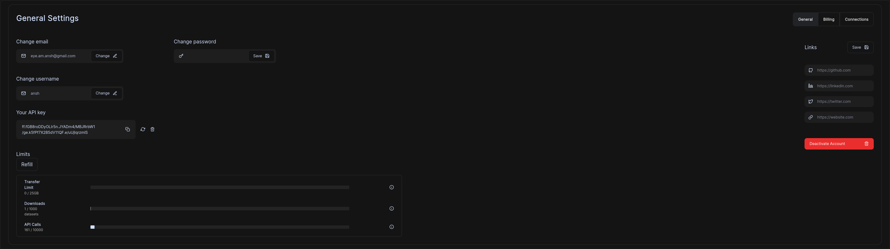

# Installation

Most building and transacting datasets can be done directly through our platform, but for developers and researchers, our Python package and REST API provide extra ML-oriented tooling that can expedite your workflows.

flockfysh mainly operates through a _ffysh_, our Python package, and a _REST API_. 

ffysh comes in two distributions:
    - General package
    - PyTorch oriented booster tooling, accessible with the `[torch]` extras flag.


Open a terminal and run:
```
pip install fysh
```

Make sure that you're using a supported version of python. We've tested `fysh` for the following versions:

    -Python 3.7 
    -Python 3.8 

## Client ID

In order to use ffysh, you need to obtain a client ID key from the platform. Go to [flockfysh.ai](flockfysh.ai), and create an account. Go to your profile dashboard, and under the "General" tab, copy the API key as shown in the picture below:



Create a `.env` file, and save the API key under the `FLOCKFYSH_CLIENT_ID` variable. _ffysh_ will automatically detect and use it for first step of authorization.

## Setting up a basic flockfysh workspace

Start out by initializing a workspace directory.

```
ffysh init 
```

Perform second step OAuth authorization to obtain a device key

```
ffysh login
```

Now, let's download a public dataset. In order to find a dataset, we look for it's unique ID. It's hidden in the URL, as you'll see below:

If the dataset url is `https://flockfysh.ai/marketplace/64c93694a8cc305c46195619`, the 
ID for the dataset is `64c93694a8cc305c46195619`.

Now, downloading all permissible assets of a dataset is simple.

```
ffysh download -d 64c93694a8cc305c46195619
```

## Load a dataset directly in for training a model
To generalize local dataset management, we built an open source tool called [_refyre_](https://pypi.org/project/refyre), a dataset file management framework that allows you to extract and load in a dataset in any way you like.

It's designed to provide researchers with easy flexibility with large scale datasets, and mass file operations, while being intuitive enough for a second grader to be able to use.

Let's load in a couple images in the dataset we had going above. First, we load in our dataset

```
from ffysh import Dataset

dataset = Dataset('64c93694a8cc305c46195619')
dataset.create_stream().download()
```

This dataset contains 100 jpg files, and a 100 labels, each one corresponding to a jpg. Let's see how we can seamlessly bring it to life for a ML pipeline.

Next, we start bringing in the relevant data using refyre. Add the following text to `in.txt`.

```
[dir="downloads"]
    [dir="64c93694a8cc305c46195619"|pattern="g!*.jpg"|name="images"]
    [dir="64c93694a8cc305c46195619"|pattern="g!*.txt"|name="labels"]
```

In a nutshell, this _input specification_ tells refyre to extract all images, and labels, and **stores** them in two variables which have names specified by the `name` attribute (images, labels). Now, we can programmatically access them with the following lines of code.

```
from refyre import Refyre

ref = Refyre(input_specs=['in.txt'])
image_var, label_var = ref["images"], ref["labels"]
```

`image_var` and `label_var` contain an array of `Path` objects, which can be used to individually manipulate any file as we see fit.


But right now, there's no clear way to _associate_ the labels, i.e tell which image relates to which label. Let's fix that by creating an `AssociationCluster`.

Our association cluster will attempt to find the appropriate pairings, by using a mapper function. Return a valid pairing by returning anything other than a `None`. In our case, our images and labels follow a convention - they both have the same filestem. So, you could expect `apple.jpg` to have a corresponding label in `apple.txt`.

```
def mapper(img, label):
    
    if img.stem == label.stem:
        return (img, label)

    return None 
```

Next, we'd want to define some basic pre-processing we'd do before we serve our data to our model for training. Let's use some PyTorch wizardry to convert them to PIL images, and be ready to be served by a PyTorch `DataLoader`.

```
def processor(img, label):

    t = Compose([
        ToTensor(),
        Resize((500, 500)),
    ])

    return t(Image.open(img))
```

Just a basic method to tweak any association finding we find by converting the image into a tensor and resizing.

Now, let's create our cluster.
```
assoc = AssociationCluster(one_to_one=True, input_vars = [image_var, label_var], mapper_function=mapper)
```

Boom. Now, we can create our PyTorch Dataset and DataLoader, with zero boilerplate using some refyre wizardry. refyre's `TorchStack` serves each association, applying the processor method before returning the item.

```
from refyre.datastack.TorchStack import TorchStack
from torch.utils.data import DataLoader

dataset = TorchStack(assoc, processor = processor)
dataloader = DataLoader(dataset, batch_size=4, shuffle=True)
```

Perfect, we've set up the groundwork for a ML pipeline. We can now check the dataloader to see what's inside!

```
import numpy as np
import matplotlib.pyplot as plt

i = 0
j = 0
for batch in dataloader:
    i += 1
    print(f'Batch {i}')
    for image in batch:
        j += 1
        plt.imshow(image.numpy()[0])
        plt.show()

print(f'Number of batches: {i}', f'Number of images: {j}', f'Dataset size: {dataset.length}')
```


Our systems are focused on compatibility, and easily integrate into common Python ML frameworks such as PyTorch (2.0 support!) or TensorFlow. We highly recommend taking a look at our [python](Python/main.md) documentation. Our systems easily integrate in, providing you, for example, with PyTorch dataset inferfaces that you can directly apply or inherit to modify.